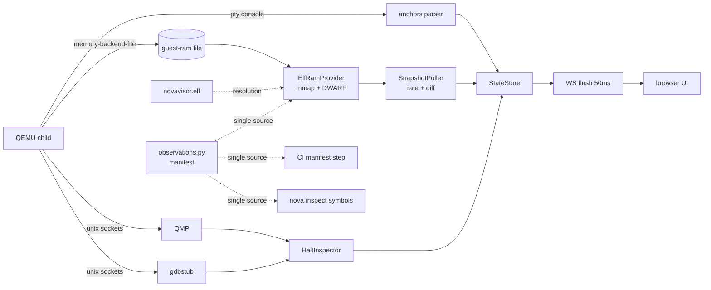

# NovaVisor Workbench

The workbench is a live observation and control UI for the hypervisor running
under QEMU. A single Python bridge process owns the QEMU child and serves a
browser UI; everything the firmware prints, plus the firmware's actual in-memory
state, streams to the browser over one WebSocket.

Observation is layered by cost and fidelity:

| Layer | Source | Fidelity | Status |
|---|---|---|---|
| **Console** | pty text → anchor parser | events as the firmware narrates them | M1 |
| **S** (snapshot) | guest RAM mmap + DWARF decode, polled | real state, may race a writer | M2 |
| **T** (trace) | in-firmware trace ring | ordered causality | planned (M3) |
| **H** (halt) | QMP stop + gdb register read | ground truth at a frozen instant | M2 |

This document covers both how to *use* the workbench (Part I) and how to
*extend* it (Part II).

---

## Part I — User guide

### Quick start

```bash
./scripts/bootstrap                    # once: toolchain + pinned Python env
./scripts/nova workbench serve        # serve on http://127.0.0.1:8787/
./scripts/nova workbench serve 10     # ...and launch demo 10 immediately
```

Open `http://127.0.0.1:8787/` in a browser. Options:

```text
nova workbench serve [DEMO] [--host ADDR] [--port N] [--variant NAME] [--verify]
```

- `DEMO` — demo ID or directory name to build and launch on startup. Without
  it the bridge starts idle; pick a target from the UI instead.
- `--variant` — a named variant from the demo's manifest.
- `--verify` — run the demo's verification scenario instead of an interactive
  session, streaming each matched pattern into the UI.
- One QEMU session per bridge. Run several bridges on different ports if you
  need parallel targets.

To stop the server, press `Ctrl-C` in the terminal running `serve` (or send
`SIGINT` to a backgrounded bridge: `kill -INT <pid>`). Shutdown tears the whole
session down: the QEMU child is terminated and the observation surfaces under
`/dev/shm/nova-wb-*` are removed. Closing the browser tab only drops that
client — the bridge and QEMU keep running for the next connection.

### The screen

```text
┌──────────────────────────── header ─────────────────────────────┐
│ target picker · 실행/재실행/일시정지 · phase/conn badges · clock │
├─────────┬───────────────────────────────┬───────────────────────┤
│ topology│ console (per-VM tabs)         │ VM cards              │
│ (rail)  │ panic banner                  │ measurement panels    │
│         │ UART input line               │ event log + filters   │
└─────────┴───────────────────────────────┴───────────────────────┘
```

- **Header** — pick a demo and press `실행` (run). `재실행` (rerun) reappears
  after exit. The phase badge tracks the session lifecycle
  (`building → running → verifying → exited/failed`); the connection badge
  tracks the WebSocket; the loss counter appears only if the bridge had to
  drop frames; the clock is the bridge's session clock.
- **Topology rail** — the running demo, its guests and vCPU counts, taken from
  the demo manifest.
- **Console** — one tab per VM plus the hypervisor. The input line sends UART
  bytes to the focused guest (`Enter` to send; the `Ctrl-T` button, or the key
  itself, sends `0x14` to rotate console focus between VMs).
- **VM cards** — per-VM lifecycle summaries built from classified events.
- **Measurement panels** — live firmware state; see below.
- **Event log** — console lines classified into subsystem badges
  (TRAP, IRQ, SCHED, SMP, …) with severity; badges act as filters.

### Measurement panels (S layer)

Panels render firmware globals decoded straight out of guest RAM while the
machine runs. Field names come from the firmware's own debug info; values
refresh at each topic's polling rate and only when they change.

| Panel | What it shows |
|---|---|
| **Scheduler** | per-pCPU current vCPU, FP ownership/trap, idling; per-slot power (`kOff/kOnPending/kOn`), run state, affinity, validity; slice ticks |
| **Timer** | armed soft-timer slots per CPU with owner labels (slice, cntv_wake, watchdog, …) and deadlines; per-VM CNTVOFF and generation |
| **Context** | one vCPU slot at a time (picker `s0…s7`): the trap frame `x0–x30, sp, elr, spsr, esr, far` from the last EL2 entry, and the saved EL1 register bank |
| **IVC** | both shared-memory rings at PA `0x6000_0000`: write/read indices and a 16-cell occupancy strip |
| **PSCI·SMP** | per-VM lifecycle (mode, epoch, pending core mask, retries, active, restart budget) and per-core online/mailbox state |
| **Devices** | vUART FIFO head/count/IMSC, DMA registry entries (owner, state, generation, deadline, bus-master block), watchdog update sequences |
| **Sysreg** | H-layer ground truth captured by the pause button (see below) |

Reading values:

- Register-like values are hex strings (they are bit patterns; JSON numbers
  lose exactness past 2^53).
- A saturated 64-bit sentinel (`kNoVcpu`, `kNoDeadline`, …) renders as `—`.
- Booleans render as `●` / `·`.
- Each panel's freshness line shows the source layer (`src S` / `src H`) and
  the session timestamp of its newest frame.

### Pause: H-layer inspection

The `일시정지` (pause) button appears while a session runs:

1. The bridge issues QMP `stop` — the whole machine freezes, **including the
   virtual clock**, so the guest cannot observe the pause.
2. A gdb remote-protocol client reads, per core:
   `pc, HCR_EL2, VTTBR_EL2, VTCR_EL2, SCTLR_EL2, CNTVOFF_EL2, CNTV_CTL_EL0,
   CNTV_CVAL_EL0, ELR_EL2, SPSR_EL2` — published to the **Sysreg** panel.
3. The machine **stays stopped** until you press `재개` (resume).

While paused, console input is rejected (the pty would buffer it and replay
it into the guest on resume). If the register sweep fails after the stop
already landed — say the gdb socket is taken by an external debugger — the
bridge rolls the stop back and resumes the machine, so a failed pause never
leaves a silently frozen machine. Reloading the page while paused is safe:
the pause state (and the 재개 button) is restored on connect.

Known limit: QEMU's gdbstub exposes no `ICH_*`/`ICC_*` registers, so GIC and
list-register state is not part of the halt sweep; the S-layer vGIC shadow is
the source for interrupt state.

### Verify runs

`nova workbench serve <demo> --verify` streams the verification scenario:
each matched expectation appears in the event log with its index and elapsed
time, and the session ends with a `verify-pass` / `verify-fail` badge (the
failure kind and unmatched pattern are shown on failure).

### The CLI twin

Everything the S layer observes can be asked from the terminal, without a
bridge or a browser:

```console
$ ./scripts/nova inspect symbols
topic                address    size    hz  shape
sched.cpu         0x400460a0      48    20  CpuSched{current,fp,fp_trap,idling}[2]
timer.queue       0x4006aa90    1408    10  Slot{deadline,fn,arg,armed}[22][2] -> deadline,armed
ivc.page          0x60000000    4096    10  ivc_page{ring0,ring1}
...
```

This resolves the same observation manifest against the built debug ELF using
the same reader the poller uses.

### Troubleshooting

| Symptom | Meaning |
|---|---|
| Panels show `실측 대기 중` | No session is running yet, or the S provider could not attach. Watch the event log for `snapshot-unavailable` (symbol resolution failed — rebuild the image) |
| `유실 N` badge | The frame window overflowed (oldest console frames are dropped first); click to reset the counter |
| Pause rejected (`qmp: session is …`) | The pause path needs a RUNNING interactive session with observation surfaces; it is unavailable while building, verifying, or idle |
| Port already in use | Another bridge is running; pick `--port` or stop it |

---

## Part II — Developer guide

### Architecture



Bridge modules (`scripts/novakit/services/workbench/`):

| Module | Responsibility |
|---|---|
| `taxonomy.py` | badge/severity vocabulary — single source, shipped to the UI in the topo snapshot |
| `anchors.py` | pty chunks → lines → classified events (pure functions) |
| `protocol.py` | envelope construction, uplink validation, session clock |
| `store.py` | frame batching window, late-joiner backlog replay |
| `session.py` | QEMU child lifecycle, `Surfaces`, verify streaming |
| `server.py` | the only socket owner: WS serving, static files, poll loop, halt commands |
| `static.py` | pure static-file resolution for the UI |
| `elfsym.py` | forward Itanium mangling, symtab lookup, DWARF layout reader, `decode()` |
| `observations.py` | **the observation manifest** (see below) |
| `snapshot.py` | `SnapshotProvider` seam, `ElfRamProvider`, `SnapshotPoller`, hand-declared guest-page layouts |
| `halt.py` | `QmpClient`, `GdbClient` (RSP), `HaltInspector` |
| `checks.py` | manifest-vs-image contract (CI step) and the `inspect symbols` report |

UI modules (`web_sim/workbench/js/`): `main.mjs` (wiring), `net.mjs`
(reconnect + seq dedup), `topology.mjs`, `console.mjs`, `cards.mjs`,
`events.mjs`, `panels.mjs` (measurement panels), `format.mjs`.

### Observation surfaces

`board.attach_workbench(command, *, shm_path, qmp_path, gdb_path=None)` extends
a composed QEMU command **additively** — the frozen `MACHINE_ARGS` are never
edited. Guest RAM becomes a shareable file (`memory-backend-file`, `share=on`),
and QMP/gdb listen on unix sockets. `session.Surfaces` owns the endpoints under
a short `/dev/shm/nova-wb-*` directory (unix socket paths are limited to ~108
bytes) and resets them between runs so a restart never reads stale RAM.

Address translation is one constant: the image is identity-mapped from
`RAM_BASE = 0x4000_0000`, so `file_offset = address − RAM_BASE`.

### Wire protocol

Every frame is one envelope; a WebSocket message is a **batch** (JSON array)
flushed every 50 ms:

```json
{"v": 1, "seq": 412, "topic": "sched.cpu", "kind": "snapshot",
 "ts": 3.417, "src": "S", "data": {"values": [...]}}
```

- `seq` is monotonic per bridge; clients drop duplicates (a frame may be seen
  twice across connect replay and the next flush).
- On connect a client receives a freshly **published** topology snapshot plus
  a bounded backlog — a late joiner is never blank. The connect topo also
  carries live session state the evictable backlog cannot guarantee:
  `session` (a per-bridge token — a change means the bridge restarted),
  `phase`, `paused`, and `run_id` (a change is a run boundary; the client
  clears panel values and counters).
- Structural downlink topics are fixed (`topo, console, ev, life, verify,
  sysreg`); **S-layer topics are plain strings taken from the manifest**, so
  adding an observation adds a topic without touching the protocol.
- Every panel-consumed snapshot (S topics and `sysreg`) carries its payload
  under `data.values` — one contract for the whole panel drawer.
- Uplink (client → bridge): `target` (launch a demo), `uart` (bytes to the
  focused guest), `qmp` (`{"cmd": "stop"|"cont"}`). Recognised-but-deferred
  topics are answered with an explicit `unsupported` event so the UI degrades
  visibly.

### The observation manifest (S layer)

`observations.py` is the single source of what the workbench watches:

```python
Obs("sched.cpu", "nova::vcpu::g_sched", rate_hz=20)
Obs("ctx.trap",  "nova::vcpu::g_vcpus", fields=("ctx",), rate_hz=2, hex=True)
Obs("ivc.page",  "", pa=0x6000_0000, layout="ivc_ring_page", hex=True)
```

- `topic` — the wire topic the decoded value feeds.
- `symbol` — C++ qualified name; `elfsym.mangle()` produces the linkage name
  (no external demangler), the symtab gives address/size, DWARF gives layout.
  Anonymous namespaces are written `(anonymous)` and mangle to a
  `12_GLOBAL__N_1` component **plus an internal-linkage `L` prefix** on the
  terminal name.
- `fields` — restrict a struct decode to selected members.
- `rate_hz` — per-topic polling rate (the poll loop ticks at 50 ms).
- `hex` — ship integers as hex strings (bit patterns; JSON loses > 2^53).
- `pa` + `layout` — for state in **guest memory** (no DWARF): a fixed physical
  address decoded with a hand-declared layout from `snapshot.PAGE_LAYOUTS`.

The reader sits behind a swappable seam:

```python
class SnapshotProvider(Protocol):
    def read(self, obs: Obs) -> object: ...
    def close(self) -> None: ...
```

`ElfRamProvider` implements it with mmap + DWARF today; a firmware-published
telemetry block can replace it later without touching the poller, store, or
UI. The bridge rebuilds the provider per run (`session.run_id`) because a
rebuild moves symbols. A torn enum read (`TornRead`) skips that observation
for one tick; the next tick sees a consistent value.

**Adding an observation:**

1. Append an `Obs` entry to `OBSERVATIONS`.
2. Confirm resolution: `./scripts/nova inspect symbols` (or run
   `tests/scripts/workbench_manifest_test.py` with the debug ELF built).
3. CI enforces it from now on — the static lane's `manifest` step resolves
   every entry against the freshly built image, so a renamed symbol or a
   reshaped struct **fails the pipeline** instead of silently blanking a panel.
4. Surface it in the UI: add the topic to a panel's `topics` and render it
   (see below). Nothing else changes — the topic string itself is the wire
   contract.

### The halt path (H layer)

`halt.HaltInspector.pause()` = QMP `stop` → for each gdb thread (one per
core): select with `Hg`, read `INSPECT_REGISTERS` by name via `p<regnum>`.
Register numbers come from the stub's `target.xml` (including `xi:include`d
documents): sequential assignment unless a `regnum` attribute says otherwise.
The result is published as one `sysreg` snapshot (`src: "H"`) followed by a
`paused` life event; `resume()` issues `cont`. The machine stays stopped
between the two — pausing is an inspection state, not a transient.

Measured limit: the stub advertises 263 registers with no `ICH_*`/`ICC_*`,
so interrupt/list-register truth remains an S-layer concern.

### UI panels

`panels.mjs` holds a `PANELS` array; each panel declares its topics and a
render function over the latest per-topic values:

```js
{
  id: "sched",
  title: "Scheduler",
  topics: ["sched.cpu", "sched.slots", ...],
  render(body) { /* build DOM from value(topic) calls */ },
}
```

Rules the tests enforce and the design assumes:

- **Latest-value re-render** — panels re-render from a `topic → latest value`
  map, so frame order and rate never matter. Never accumulate frames.
- **Thin client** — subsystem vocabulary (badges, severities) arrives in the
  topo snapshot; UI modules must not hard-code taxonomy strings
  (`workbench_ui_test.py` greps for them).
- A topic may feed several panels (the interest map is `topic → Set`;
  `sched.valid` feeds both Scheduler and Context).
- Display rules live in `fmt()`: sentinel `≥ 9e15` → `—`, booleans → `●`/`·`.

Adding a panel = one more entry in `PANELS` (plus CSS if it needs new
primitives). The drawer, tab wiring, freshness line, and topic routing are
generic.

### Testing and contracts

| Test | Guards |
|---|---|
| `workbench_ui_test.py` | every referenced asset exists, every module import resolves, no hard-coded taxonomy badges, token parity with the frozen sim |
| `workbench_manifest_test.py` | every observation resolves against the real debug ELF; key struct layouts; the `inspect symbols` report covers every topic |
| `workbench_elfsym_test.py` | mangling table, decode contracts |
| `workbench_snapshot_test.py` | poller rate/diff behavior (fake provider), `ElfRamProvider` against seeded RAM, short-backend rejection |
| `workbench_halt_test.py` | `GdbClient` against a scripted fake stub (target.xml regnum sequencing), `QmpClient` against a fake QMP server |
| `workbench_session_test.py` | session lifecycle, surfaces attachment, verify streaming, uplink rejection paths |
| `automation_contract_test.py` | public CLI leaves (`workbench serve`, `inspect symbols`, …), `attach_workbench` leaves the board model frozen |
| `automation_layer_test.py` | dependency boundaries: `websockets` only in `server.py`, `elftools` only in `elfsym.py`, `asyncio` only in `server.py`/`session.py`, `pexpect` only in `spawn.py` |

Run everything with `./scripts/nova test`; the same suites run in the CI
`host` lane, and the manifest contract also runs as the `static` lane's
`manifest` step.

### Design notes worth knowing

- **Executor fast-path**: awaiting an already-completed `run_in_executor`
  future does not yield to the event loop, so callbacks a worker queued with
  `call_soon_threadsafe` can be overtaken. The verify path yields once
  (`await asyncio.sleep(0)`) after the worker returns; keep this in mind for
  any new executor + marshalling pattern.
- **Connect replay is newest-first for topology**: clients dedup by `seq`,
  and topology snapshots carry the highest `seq` wins semantics (`topoSeq`).
- The frozen HTML simulator (`web_sim/novavisor-sim.html`) is local-only and
  not tracked; only `web_sim/workbench/` is under version control, and
  `tokens.css` is the authoritative palette both agree on.
