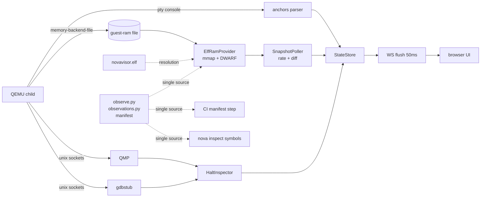

# NovaVisor Workbench

The workbench is a live observation and control UI for the hypervisor running
under QEMU. A single Python bridge process owns the QEMU child and serves a
browser UI; everything the firmware prints, plus the firmware's actual in-memory
state, streams to the browser over one WebSocket.

Observation is layered by cost and fidelity:

| Layer | Source | Fidelity | Status |
|---|---|---|---|
| **Console** | pty text → anchor parser | events as the firmware narrates them | M1 |
| **S** (snapshot) | guest RAM mmap + DWARF decode, polled | real state, may race a writer | M2 |
| **T** (trace) | in-firmware trace ring, drained | ordered causality | M3 |
| **H** (halt) | QMP stop + gdb register read | ground truth at a frozen instant | M2 |

A path on the board is stroked by what watches it, and never by more
than that. All eleven are direct evidence on a debug image — a
breakpoint can arrive at them, or the rings record them — and the grade
is computed from what *this* run can do, so the same board drawn against
a stripped image with no rings shows none of them as direct. The two the
hardware performs without entering EL2, `dma` and `walk`, are watched
where the route is set up rather than in transit — the transfer starting
and the stream being bound to a VM's tables — because a hook that fires
only on a fault has watched nothing about the working path.

This document covers both how to *use* the workbench (Part I) and how to
*extend* it (Part II).

---

## Part I — User guide

### Quick start

```bash
./bootstrap                # once: toolchain + pinned Python env
./nova workbench serve     # serve on http://127.0.0.1:8787/
./nova workbench serve 10  # ...and launch demo 10 immediately
```

Open `http://127.0.0.1:8787/` in a browser. Options:

```text
nova workbench serve [DEMO] [--host ADDR] [--port N] [--variant NAME] [--verify]
                     [--trace-history RECORDS] [--record DIR]
```

- `DEMO` — demo ID or directory name to build and launch on startup. Without
  it the bridge starts idle; pick a target from the UI instead.
- `--variant` — a named variant from the demo's manifest.
- `--verify` — run the demo's verification scenario instead of an interactive
  session, streaming each step into the UI.
- `--record` — write the run to a directory exactly as the wire carried it;
  `nova workbench replay DIR` serves it back with no QEMU and no image.
- One QEMU session per bridge. Run several bridges on different ports if you
  need parallel targets.

To stop the server, press `Ctrl-C` in the terminal running `serve` (or send
`SIGINT` to a backgrounded bridge: `kill -INT <pid>`). Shutdown tears the whole
session down: the QEMU child is terminated and the observation surfaces under
`/dev/shm/nova-wb-*` are removed. Closing the browser tab only drops that
client — the bridge and QEMU keep running for the next connection.

### The screen

```text
┌──────────────────────────── header ─────────────────────────────┐
│ 타깃 · 변형 · 검증 · 실행/정지 · 일시정지 · phase/conn · clock   │
├─────────┬───────────────────────────────┬───────────────────────┤
│ topology│ console (per-VM tabs)         │ VM cards              │
│ (rail)  │ panic banner                  │ measurement panels    │
│         │ UART input line               │ event log + filters   │
└─────────┴───────────────────────────────┴───────────────────────┘
```

- **Header** — pick a demo, a variant if it declares any (the picker is hidden
  when it does not) and `검증` to run its verification scenario instead of an
  interactive machine, then press `실행`. That is one button with two meanings:
  it reads `정지` while a machine is building, running or verifying and stops
  it, and either way it disarms until the next phase arrives, so a click storm
  is one request. A `정지` pressed while the build is still running is held
  behind it and lands the moment the machine comes up — the notice says so
  rather than implying an immediate stop. The last launch — demo, variant and
  verify — is remembered for the next reload. In a replay there is no machine
  for any of this to reach, so the whole group — picker, variant, `검증`,
  `실행` and `일시정지` — is disabled. The phase badge tracks the session lifecycle
  (`building → running → verifying → exited/failed`); the connection badge
  tracks the WebSocket; the loss counter appears only if the bridge had to
  drop frames; the clock is the bridge's session clock.
- **Topology rail** — the running demo, its guests and vCPU counts, taken from
  the demo manifest.
- **Console** — one tab per VM plus the hypervisor. The input line sends UART
  bytes to the focused guest (`Enter` to send; the `Ctrl-T` button, or the key
  itself, sends `0x14` to rotate console focus between VMs). It stands down
  wherever the bridge would refuse the bytes — no running machine, a paused
  one, or a replay — as do the command panel's buttons. A dot marks the tab
  the last observed switch named — not a live reading: a browser that joined
  later has seen none, and the firmware re-routes focus by itself when the
  focused VM dies without printing a line. Each run boundary clears it.
- **VM cards** — per-VM lifecycle summaries built from classified events.
- **Measurement panels** — live firmware state; see below.
- **Event log** — console lines classified into subsystem badges
  (TRAP, IRQ, SCHED, SMP, …) with severity; badges act as filters.

### Measurement panels (S layer)

Panels render firmware globals decoded straight out of guest RAM while the
machine runs. Field names come from the firmware's own debug info; values
refresh at each topic's polling rate and only when they change.

**Which drawer a reading lands in is its own topic name.** Every topic is
spelled `subsystem.thing`, so the prefix is the drawer: a topic the bridge
starts publishing arrives in a drawer named after its subsystem, drawn as the
shape the bridge sent it in, with nothing written in the UI for it. Seven
drawers override that drawing because they join several topics into one table,
and whatever an override does not draw follows it below as a generic table. A
topic whose job is to date another one (`ctx.synced`, `vgic.synced`) is a row
nowhere — it becomes the age on the heading it dates.

The buttons above the drawer are **independent toggles, not tabs** — switch
on as many as you want and they stack in the order listed below, each with
its own header and freshness stamp. Sizes differ by an order of magnitude
(Sysreg is ten rows and only moves on a pause; the context dump is forty),
so which combination fits is your call. The choice survives a reload, and
only the drawers you have open are rendered. After a stop, each button also
carries how many values in its drawer moved since the previous stop — which
is what says which drawer to open next.

The topology advertises **what this run's image can answer**, and the drawers
follow it. A full profile publishes 31 observation topics, which with the halt
layer's `sysreg` make the ten below; a profile composing no SMMU resolves
neither `smmu.stream` nor `dev.dma`, so its runs offer no **smmu** drawer at
all and **Devices** without the DMA registry.

| Drawer | What it shows |
|---|---|
| **Scheduler** | per-pCPU current vCPU and how long it has been resident, FP ownership/trap, idling; per-slot power (`kOff/kOnPending/kOn`), run state, affinity, validity; slice ticks |
| **Timer** | per-CPU programmed deadline and the armed soft-timer slots under it with owner labels (slice, cntv_wake, watchdog, …); per-VM CNTVOFF |
| **Context** | one vCPU slot at a time (picker `s0…s7`): the trap frame `x0–x30, sp, elr, spsr, esr, far` from the last EL2 entry, why it was taken as one line (`EC` and its name, `IL`, `ISS`, `FAR`, `ELR`), and the saved EL1 register bank |
| **IVC** | both shared-memory rings at PA `0x6000_0000`: write/read indices and a 16-cell occupancy strip |
| **PSCI·SMP** | per-VM lifecycle (mode, epoch, pending core mask, retries, active, restart budget) and per-core online/mailbox state |
| **Devices** | vUART FIFO head/count/IMSC, DMA registry entries (owner, state, generation, deadline, bus-master block), watchdog update sequences |
| **Sysreg** | H-layer ground truth captured by the pause button (see below) |
| **smmu** | the stream table entries a run configured: translating through a VM's own Stage 2 root, or aborted so every transaction is refused |
| **vgic** | list registers in flight with their EoI tokens, SPI tokens bound but not yet taken into one, the INTIDs the emulated distributor has set, the resident slot per core, the LR count |
| **vm** | the guest table the machine actually built (vmid, IPA, load PA, size, vCPUs, core, uart, auto-start) and per-VM generation |

Reading values:

- Register-like values are hex strings (they are bit patterns; JSON numbers
  lose exactness past 2^53).
- A saturated 64-bit sentinel (`kNoVcpu`, `kNoDeadline`, …) renders as `—`.
- Booleans render as `●` / `·`.
- A counter value reads as the time it names: an instant as `±Δ` from the
  reference — the newest reading held, or a mark picked on the strip — and a
  length as a duration. The raw ticks stay in the tooltip.
- A reading that shadows registers living in hardware carries in its heading
  how long ago this slot's copy became true, on the machine's own clock.
- Each drawer's freshness line shows the source layer (`src S` / `src H`) and
  where its newest reading sits against that reference (`최신 ±Δ`, or `선택
  ±Δ` with a mark picked), falling back to the session timestamp of its newest
  frame while the counter's rate is still unknown.

### Pause: H-layer inspection

The `일시정지` (pause) button appears while a session runs:

1. The bridge attaches to QEMU's gdb stub, which stops the whole machine —
   **including the virtual clock**, so the guest cannot observe the pause.
   The connection *is* the stop and is held until you resume.
2. It reads, per core: `pc, HCR_EL2, VTTBR_EL2, VTCR_EL2, SCTLR_EL2,
   CNTVOFF_EL2, CNTV_CTL_EL0, CNTV_CVAL_EL0, ELR_EL2, SPSR_EL2` — published
   to the **Sysreg** panel — and then the whole observation manifest.
3. The machine **stays stopped** until you press `재개` (resume).

While paused, the console input line stands down (the pty would buffer the
bytes and replay them into the guest on resume). If the register sweep fails after the attach
already landed — say the gdb socket is taken by an external debugger — the
bridge lets go of the machine before reporting, so a failed pause never
leaves a silently frozen one. Reloading the page while paused is safe:
the pause state (and the 재개 button) is restored on connect, and so is an
inspection still in flight — 중지 comes back with it.

Known limit: QEMU's gdbstub exposes no `ICH_*`/`ICC_*` registers, so GIC and
list-register state is not part of the halt sweep; the S-layer vGIC shadow is
the source for interrupt state.

### Stopping at an event

`일시정지` stops the machine wherever it happens to be, which on a live
machine is the idle wait almost every time — ten pauses in a row land on the
same instruction. The **정지 지점** controls stop it somewhere that means
something instead:

| Control | What it does |
|---|---|
| **정지 지점** | which event to stop at, from the bridge's catalogue — or `정지 없음`, which is a choice and not merely the initial state: it is what launches a machine meant to keep going |
| **다음 사건** | run until that event, then stop; refused while nothing is chosen, since a machine advancing to no event runs until the wait budget expires and stops nowhere |
| **명령 진행** | advance by instructions — for looking *inside* an event. The box beside it says how many, from 1 to the ceiling the bridge publishes in `topo.limits.steps`; a larger number is corrected in the box rather than cut silently on the far side, and the count is remembered between sessions |
| **자동** | repeat, one second apart, so events pass at a readable speed; it stays pressed until the bridge lets the machine go |
| **중지** | take the machine back from a run that is still going, or end a step batch where it stands |

Every one of them needs a machine that is running and one the bridge is not
already holding for a command — it holds one inspection at a time, so a
second click could only be rejected. The hold is the bridge's fact, reported
at both ends (`halt-begin` with the command, `halt-end` once the machine is
let go, after the sweep) rather than remembered from the click: a 다음 사건
run can outlast its click by minutes, and an 자동 run answers fifty times
before it ends. 중지 is on screen exactly while there is a hold, whatever
asked for it — a stop armed at launch and a page reloaded mid-run included —
and 일시정지 stands down for the same hold.

A stop publishes more than a pause does. The notice names the gdb thread the
machine stopped on, which on an SMP machine is which core. The event's own
arguments are read out of the argument registers — so stopping at the interrupt
bind shows the physical INTID, the virtual one it was bound to, and the
generation — and the **whole** observation manifest is re-read and published as
`src H`. Nothing is moving, so those reads are all of one instant, with no torn
value and no writer racing the reader. This is the one place the S layer is
exact.

Paths on the board that can be stopped on are drawn solid and legended **M**.
A pulse there is not a sample or a log line; it is the event.

Two things worth knowing:

- **Stepping is for looking inside an event, not for reaching one.** A step
  costs about 700 µs over the debug socket, so the default forty is a fraction
  of a second and the ceiling a few seconds. A batch is taken one instruction
  at a time and the forward controls stand down until it finishes. Breakpoints
  are how you arrive.
- **A step at `wfi` does not finish.** The hypervisor idles there between
  events and the instruction retires only when an interrupt arrives, so the
  control reports `대기 중` and hands the machine back rather than hanging.

Short demos are over before a browser could ask for anything — the DMA demo
finishes its transfers inside the first second of guest time. Selecting a stop
before pressing 실행 arms it during EL2 boot, ahead of any guest code.

The gdb connection *is* the stop: it is held while the machine is stopped and
dropped to resume. QMP is read-only here. Mixing a QMP stop in deadlocks the
stub — a QMP-stopped machine answers no `vCont` and no breakpoint packet at
all, with no error — which is why `QmpClient` no longer offers `stop`/`cont`.

### The trace layer (T)

EL2 writes every event it reaches into per-CPU rings in a reserved
physical region, and the bridge drains them at the poll rate. That
changes what the drain interval means: it is a bound on *latency*, not
on coverage. A sampled layer misses anything shorter than its interval
no matter how fast it runs — the interrupt bind was never once caught at
10 Hz or at 500 Hz — and a ring simply has it.

The rings are a handover buffer, not a memory: each core's ring is sized
to survive one second at the peak fill the board declares — 133k records
a second a ring, a ceiling above the ~42k/s a Linux boot actually
reaches — and a build reserving less fails rather than lapping inside a
drain interval. So the drain loop runs at 5 ms on its own clock, and what
it drains goes into a 16 MiB history on the bridge, minutes deep, sized
by `--trace-history`.

Two kinds of overwrite, named apart. A firmware ring lapped before a
drain means the bridge was late, and is reported as `dropped`. The
history wrapping onto its own oldest record means the horizon was
reached, which is normal running, and is published as `span.full`.
Reporting the second as the first would leave the one actionable number
permanently non-zero on any session past a few minutes.

The note under the strip carries both, beside what the ring depth buys on
this host: `링 0.3초 @ 12k/s · 최악 정체 664ms (1/5) · 자기 CPU 99%`. That
last word says whose the worst stall was — the bridge's own CPU, its
garbage collector, or `미실행`, time the process was not running at all —
with the three terms in ms in the tooltip, because a 664 ms stall that is
99% self CPU is a fact about the instrument rather than about the machine.

The wire still carries counts per path and the last event of each,
~650 bytes per window, plus the span. The records are asked for — by
the timeline strip and by a terminal, from the same history:

```console
$ ./nova workbench trace --since 0.05
  ivc.doorbell=138  sched.switch=138  trap=277  vgic.inject=138  vgic.private=138
    270296us cpu0 vgic.bind     vm=0 vintid=37 pintid=37 generation=3
    270407us cpu0 vgic.inject   slot=0 vintid=37 lr=0 generation=3
    270732us cpu0 vgic.eoi      slot=0 vintid=37 pintid=37 generation=3
```

With a bridge running this reads that bridge's history, not the rings:
two consumers with two cursors over one ring answer differently about
one run, and the rings hold seconds where the history holds minutes.
`--since` says how far back to start and `--follow` keeps printing. With
no bridge it falls back to the rings, which is what lets it work with no
browser and no image at all. A stretch holding more records than a
terminal was asked to list comes back as a count rather than as lines —
the same rule the strip follows, and the reason a reader narrows.

An interrupt bound, injected 111 µs later, completed 325 µs after that.
Neither sampling nor a halt can produce that: one misses it, the other
shows a single instant rather than a sequence.

**What the ring records.** The catalogue is one list with two uses: 23
record kinds, 21 of which are also places the machine can be stopped.
Five cover a stretch rather than an instant — `sched.switch` is the
outgoing vCPU's residency, `timer.late` how late a slot was serviced,
`irq.latency` a guest's IRQ entry delay, `vm.lifecycle` how long a VM was
out, and `trace.gap` the part of the axis nothing was watching. The strip
draws those as bands, one sub-lane per core, so stretches that overlap in
time read as a gantt of who held which core rather than as a solid block.

The two that are not stop points are the two with no instruction to break
on. `panic` is the first EL2 failure and the caller that raised it:
console text and the ring cannot be ordered against each other, so this
is what says which records the machine wrote before it died. `trace.gap`
the reader writes itself, where records it could not recover would have
been. Of the rest, `vm.lifecycle` names how a VM's lifecycle ended —
`stopped`, `restarted`, `left_stopped`, `dma_failed`, `isolated` —
whichever of the things that begin one did, and `smmu.abort` is a stream
being shut into a blocking STE by a fault or a detach.

**A run is sealed once.** Whichever boundary arrives first — the bridge
closing, a target replaced, the machine exiting on its own — the run's
records are added up and published as one event-log row (`런 N 봉인`):
how many of each kind, broken down where the kind alone is too coarse to
act on (traps by EC, `timer.late` by slot, `vm.lifecycle` by VM), whether
the trace is whole, and for each counted span row the p99.9 its own
samples support. A quantile is claimed only for a complete run, because
a lost record is a lost sample. The same summary also rides the connect
topology, so a browser that joined after the seal still reads it.

Things worth knowing:

- **The writer never waits for the reader.** Rings overwrite when full,
  because a closed browser tab must not be able to stall EL2. Loss is
  therefore possible, and it is always counted — `dropped` on the wire
  and in the report. A demo that front-loads thousands of traps will lap
  before the bridge attaches, and says so.
- **Traps outnumber everything else by ~400:1.** An undrained region is
  almost entirely traps within a few thousand events.
- **No debug info is involved.** The region describes its own geometry,
  so the T layer works on a stripped image and keeps working when
  symbol resolution for the S layer fails.
- Cost: +1.34% on the trap-heavy Linux demo, at ~1500 events/second.

### Verify runs

`nova workbench serve <demo> --verify`, or the `검증` checkbox, streams the
verification scenario: each carried step appears in the event log as its index,
the step count, what the step was — a console pattern, a reading, an event
waited for, a walk, a command — and how long it waited, which is what names the
slow step in a scenario that ran long. The session ends with a `verify-pass`
badge or a `verify-fail` badge, both carrying how many steps were carried of
how many, and the failing one also the failure kind and the step that failed.

### The CLI twin

Everything the S layer observes can be asked from the terminal, without a
bridge or a browser:

```console
$ ./nova inspect symbols
topic                address    size    hz  shape
sched.cpu         0x400460a0      48    20  CpuSched{current,fp,fp_trap,idling}[2]
timer.queue       0x4006aa90    1408    10  Slot{deadline,fn,arg,armed}[22][2] -> deadline,armed
ivc.page          0x60000000    4096    10  ivc_page{ring0,ring1}
...
```

This resolves the same observation manifest against the built debug ELF using
the same reader the poller uses.

### Troubleshooting

| Symptom | Meaning |
|---|---|
| Panels show `실측 대기 중` | No session is running yet, or the S provider could not attach. Watch the event log for `snapshot-unavailable` (symbol resolution failed — rebuild the image) |
| `유실 N` badge | The frame window overflowed (oldest console frames are dropped first); click to reset the counter |
| Pause rejected (`halt: session is …`) | The pause path needs a RUNNING interactive session with observation surfaces; it is unavailable while building, verifying, or idle |
| Port already in use | Another bridge is running; pick `--port` or stop it |

---

## Part II — Developer guide

### Architecture



Bridge modules (`novakit/services/workbench/`):

| Module | Responsibility |
|---|---|
| `taxonomy.py` | badge/severity vocabulary — single source, shipped to the UI in the topo snapshot |
| `anchors.py` | pty chunks → lines → classified events (pure functions) |
| `protocol.py` | envelope construction, uplink validation, session clock |
| `store.py` | frame batching window, late-joiner backlog replay |
| `session.py` | QEMU child lifecycle, `Surfaces`, verify streaming |
| `server.py` | the only socket owner: WS serving, static files, the loops it drives, the handler table every uplink is admitted by |
| `dispatcher.py` | uplink parsing, per-topic preconditions, query slotting and cancellation |
| `static.py` | pure static-file resolution for the UI |
| `observations.py` | **half the observation manifest**: how each topic is sampled and spelled (see below) |
| `derive.py` | firmware bit encodings turned into what they mean, once, before the wire |
| `snapshot.py` | `SnapshotProvider` seam, `ElfRamProvider`, `SnapshotPoller`, hand-declared guest-page layouts |
| `poller.py` | the poll loop: publishes S-layer snapshots and keeps the observation and memory-map state |
| `halt.py` | `QmpClient` (read-only), `GdbClient` (RSP), `HaltInspector` |
| `inspector.py` | the H layer's asynchronous half: pause, step, advance, and what a stop publishes |
| `trace.py` | `TraceReader` (T layer), the wire summary, window shaping, a run's totals, and the `nova workbench trace` report |
| `trace_drain.py` | the drain loop and the turnaround budget it paces itself by |
| `history.py` | the bridge's memory of a run: an overwriting ring of drained records, and the span it publishes |
| `events.py` | **the event catalogue** — where the machine can be stopped, what each record's words hold, which path a stop is evidence for, and what this run can actually witness |
| `paths.py` | the paths the board draws, and the rule that none may look more certain than what watches it |
| `hardware.py` | the board map the UI draws, read from the headers that already define it |
| `regimes.py` | the translation regimes a run has, and the tables behind them |
| `translation.py` | descriptor encodings, and the walk over them |
| `commands.py` | what the host may ask a running machine for, and how it asks |
| `steps.py` | the steps a console cannot carry: read state, wait for an event, drive the machine |
| `recording.py` | writing a run down as the wire carried it, and reading it back |
| `client.py` | the other end of the wire: a terminal asking a running bridge for what it holds |
| `checks.py` | manifest-vs-image contract (CI step) and the `inspect symbols` report |

Reading the ELF is not one of them: symbol addresses and DWARF layouts are a
build input, read by `novakit/image/elfsym.py`.

UI modules (`web/workbench/js/`): `main.mjs` (wiring), `net.mjs`
(reconnect + seq dedup), `topology.mjs` (the launch group and the guest
rail), `stepper.mjs` (the stop picker and the three ways to reach one),
`console.mjs`, `cards.mjs`, `events.mjs`, `panels.mjs` (the panel
drawers), `board.mjs` (the machine drawn as layers), `memory.mjs` (what
an address means on this machine), `drive.mjs` (the command ring),
`timeline.mjs` (the time axis), `format.mjs`, and `primitives/` — the
table and stream-log widgets the views share.

### The time axis

Under the board, in the same view so its height comes from the board's
share rather than from the column the console already negotiates for.
One `<canvas>`: a few thousand marks as DOM nodes would spend the board's
per-batch layout budget many times over.

Everything is binned into the columns the strip actually has. Two
hundred events in one pixel drawn as two hundred marks is a solid block,
and a solid block reads as "continuously busy" whether it was two events
or two thousand; a window of single events falls out of the same
arithmetic as plain ticks, so there is no mode to switch.

A lane whose records cover a stretch is painted as bands under the marks,
and split into one sub-lane per core the board published. Stretches on
different cores overlap in time, so one band per lane would stack them
and a run of switches would read as a solid block rather than as a gantt
of who held which core. Where a lane appears, and which record draws in
it, both come from the catalogue the topology carried.

The canvas is an output and never the storage. Following moves the x
mapping every frame and a resize rescales it, so a strip keeping its
history in painted pixels would lose it at the first resize and — since
following asks only for the tail — never get it back.

Drag narrows and stops following, double-click widens to everything the
bridge holds, and the follow button returns to the present. Clicking a
mark names the record and lights its path on the board; shift-clicking a
second gives the gap between them. A picked mark offers **여기서 멈추기**,
which is where one catalogue for two consumers is repaid: the moment
found in the trace is already a stop point, so wanting the next one is a
lookup rather than a second table.

### Observation surfaces

`board.attach_workbench(command, *, shm_path, qmp_path, gdb_path=None)` extends
a composed QEMU command **additively** — the frozen `MACHINE_ARGS` are never
edited. Guest RAM becomes a shareable file (`memory-backend-file`, `share=on`),
and QMP/gdb listen on unix sockets. `session.Surfaces` owns the endpoints under
a short `/dev/shm/nova-wb-*` directory (unix socket paths are limited to ~108
bytes) and resets them between runs so a restart never reads stale RAM.

Address translation is one constant: the image is identity-mapped from
`RAM_BASE = 0x4000_0000`, so `file_offset = address − RAM_BASE`.

### Wire protocol

Every frame is one envelope; a WebSocket message is a **batch** (JSON array)
flushed every 50 ms:

```json
{"v": 3, "seq": 412, "topic": "sched.cpu", "kind": "snapshot",
 "ts": 3417000000, "src": "S", "data": {"values": [...]}}
```

- `seq` is monotonic per bridge; clients drop duplicates (a frame may be seen
  twice across connect replay and the next flush).
- `ts` is session-monotonic nanoseconds, anchored at bridge start.
- On connect a client receives a freshly **published** topology snapshot plus
  a bounded backlog — a late joiner is never blank. The connect topo also
  carries live session state the evictable backlog cannot guarantee:
  `session` (a per-bridge token — a change means the bridge restarted),
  `phase`, `paused`, `halt` (the command the bridge holds the machine for,
  or null), and `run_id` (a change is a run boundary; the client clears
  panel values and counters).
- H-layer life events: `halt-begin` (`cmd`) and `halt-end` bracket every
  inspection the bridge holds the machine for, and `armed` (`stops`) is
  published each time a run lets the machine go again — at launch and at
  every repeat — so a client's pause state follows the machine rather than
  the last stop it saw.
- Structural downlink topics are fixed (`topo, console, ev, life, verify,
  sysreg, trace`); **S-layer topics are plain strings taken from the manifest
  this run's image answers**, so adding an observation adds a topic without
  touching the protocol.
- Every panel-consumed snapshot (S topics and `sysreg`) carries its payload
  under `data.values` — one contract for the whole panel drawer.
- Uplink (client → bridge): `target` (launch a demo — `variant`, `verify`, and
  `stops` to arm as the machine boots), `stop` (point the session at nothing),
  `uart` (bytes to the focused guest), `halt`
  (`{"cmd": "stop"|"cont"|"step"|"run"|"abort", ...}` — `run` takes `stops`,
  `repeat` and `period`; `step` takes `count`, bounded by
  `topo.limits.steps`), `cmd` (an op into the firmware's command ring),
  `probe` (an address to translate), and `cursor`
  (where in a replay the reader is looking). `trace`, `probe` and `cursor`
  travel both ways: the kind tells a request from a frame sent unasked, and a
  second topic for asking would say the same word twice.
- Every uplink carries a `request_id`, and the frame answering it reflects it
  as `reply_to`, so readers sharing one broadcast never consume one another's
  answers. A topic with no handler, or one whose precondition this session
  does not meet, is refused by name in an `uplink-rejected` life event rather
  than ignored.

### The observation manifest (S layer)

The manifest is two halves that meet at the topic, and neither answers alone:
a topic in one and not the other stops the bridge at startup.
`novakit/image/observe.py` is the build's half — which global feeds which
topic and which of its members travel, since only an image can answer that.
`observations.py` is the bridge's — how often a topic is sampled and how it is
spelled on the wire.

```python
# image/observe.py — what to read
Want("sched.cpu", "nova::vcpu::g_sched")
Want("ctx.trap",  "nova::vcpu::g_vcpus", ("ctx",))

# observations.py — how it is sampled and spelled
"sched.cpu": Policy(rate_hz=20, shape=derive.none_if_unset, stamps=("since",))
"ctx.trap":  Policy(rate_hz=2, hex=True, as_of="ctx.synced")
Obs("ivc.page", pa=_BOARD["NOVA_BOARD_IVC_SHM_PA"],
    layout="ivc_ring_page", hex=True)
```

- `topic` — the wire topic the decoded value feeds, and, in its prefix, the
  drawer it is drawn in.
- `symbol` — C++ qualified name; `elfsym.mangle()` produces the linkage name
  (no external demangler), the symtab gives address/size, DWARF gives layout.
  Anonymous namespaces are written `(anonymous)` and mangle to a
  `12_GLOBAL__N_1` component **plus an internal-linkage `L` prefix** on the
  terminal name.
- `fields` — restrict a struct decode to selected members.
- `rate_hz` — per-topic polling rate (the poll loop ticks at 50 ms), checked
  against the rate the firmware itself publishes at rather than clamped to it:
  a clamp would make a typo behave like a considered number.
- `hex` — ship integers as hex strings (bit patterns; JSON loses > 2^53).
- `shape` — a firmware encoding turned into what it means before the wire
  (`derive.py`): an all-bits-set "none" becomes null, a packed list register
  becomes the interrupts it is carrying.
- `as_of` — for memory that shadows registers living in hardware: the topic
  carrying when that copy became true. It is drawn as no row of its own; it
  becomes the age on the heading it dates.
- `stamps` / `durations` — which of a reading's fields hold a counter instant
  and which a count of ticks. No ELF can say it — the DWARF reader folds a
  typedef into its underlying type — so it is declared here beside `hex`, and
  it is what lets a panel show a time instead of a number.
- `pa` + `layout` — for state in **guest memory** (no DWARF): a fixed physical
  address decoded with a hand-declared layout from `snapshot.PAGE_LAYOUTS`.

The reader sits behind a swappable seam:

```python
class SnapshotProvider(Protocol):
    def read(self, obs: Obs) -> object: ...
    def close(self) -> None: ...
```

`ElfRamProvider` implements it with mmap + DWARF today; a firmware-published
telemetry block can replace it later without touching the poller, store, or
UI. The bridge rebuilds the provider per run (`session.run_id`) because a
rebuild moves symbols. A torn enum read (`TornRead`) skips that observation
for one tick; the next tick sees a consistent value.

**Adding an observation:**

1. Append a `Want` to `observe.OBSERVED` and a `Policy` to `POLICY`, under
   the same topic.
2. Confirm resolution: `./nova inspect symbols` (or run
   `tests/workbench/manifest_test.py` with the debug ELF built).
3. CI enforces it from now on — the static lane's `manifest` step resolves
   every entry against the freshly built image, so a renamed symbol or a
   reshaped struct **fails the pipeline** instead of silently blanking a panel.
4. Nothing in the UI. The topic's prefix names its drawer and the reading is
   drawn there in the shape the bridge sent; an override is written only to
   join it with other topics into one table. The topic string itself is the
   wire contract.

### The halt path (H layer)

`halt.HaltInspector.pause()` = QMP `stop` → for each gdb thread (one per
core): select with `Hg`, read `INSPECT_REGISTERS` by name via `p<regnum>`.
Register numbers come from the stub's `target.xml` (including `xi:include`d
documents): sequential assignment unless a `regnum` attribute says otherwise.
The result is published as one `sysreg` snapshot (`src: "H"`) followed by a
`paused` life event; `resume()` issues `cont`. The machine stays stopped
between the two — pausing is an inspection state, not a transient.

Every command the controller takes — `stop`, `cont`, `step`, `run`, and the
arm at launch — runs inside one hold, published as `halt-begin`/`halt-end`
around it and carried on the connect topo as `halt`. `abort` is the one
command taken during a hold; a run's wait loop asks for it between slices
and a step's instruction loop between instructions.

Measured limit: the stub advertises 263 registers with no `ICH_*`/`ICC_*`,
so interrupt/list-register truth remains an S-layer concern.

### The event catalogue (T and H layers)

`events.py` is one list with two consumers, because a stop point and a trace
hook are one fact about the firmware: "here is a moment worth naming". An
entry names the symbol a breakpoint lands on, the `code` the firmware writes a
record under, what the record's three words hold (`fields`, with `x|y` where
one word carries a packed pair), which of them are addresses (`hex`), which
word ends the stretch a record covers (`span`), which one a run's totals are
broken down by (`group`), and the ABI define family that names a coded word
(`names`). An entry with no symbol is a record kind and not a stop — the two
that have none say so by omission rather than by a second table.

**Adding a record kind is that one entry.** `decode()` is derived from the
spellings rather than branching per event, so nothing downstream has to learn
a layout: the picker offers it if it has a symbol, the strip gives it a lane
(a band, if it has a span), the event log names its fields, and a run's seal
counts it — broken down by `group` where it has one. Only two irregular words
are left as branches, mmio's flag word and command's paired vocabularies.

### UI drawers

`panels.mjs` derives the drawers from the topic names the topology publishes —
the prefix of `subsystem.thing` is the drawer — so a new observation needs no
entry here. `OVERRIDES` holds the seven drawers that draw for themselves, each
naming what it draws and what it reads:

```js
{
  id: "ctx",
  title: "Context",
  draws: ["ctx.trap", "ctx.el1", "ctx.syndrome"],
  reads: ["sched.valid"],          // another drawer's topic, joined in here
  render(body) { /* build DOM from at(topic) cursors */ },
}
```

Rules the tests enforce and the design assumes:

- **Latest-value re-render** — drawers re-render from a `topic → latest value`
  map, so frame order and rate never matter. Never accumulate frames.
- **Thin client** — subsystem vocabulary (badges) arrives in the topo snapshot;
  UI modules must not hard-code taxonomy strings, which `web/eslint.config.mjs`
  refuses by reading the badge list from `taxonomy.py` itself.
- **`draws` and `reads` are both interest.** Whatever an override does not
  draw follows it as a generic table of the shape the bridge sent, and a topic
  it reads from another drawer has to be declared or the drawer sits still on
  the frame that moved it. A topic may feed several drawers (the interest map
  is `topic → Set`; `sched.valid` feeds Scheduler and Context).
- **Open drawers are a set, not a selection.** The strip is `role="group"` of
  `aria-pressed` toggles — a `tablist` would promise single selection that
  the drawer does not honour. A frame marks only the *visible* drawers its
  topic feeds (`dirty` is a `Set`), and `settle()` redraws exactly those
  once per flush window, so cost tracks what changed, not what is open.
- **A renderer reads a cursor, never a bare value.** The cursor carries what
  moved since the previous stop and how a counter field reads as a time; a
  cell built without one is a fault this file reports rather than a table that
  quietly loses its provenance.
- Display rules are shared by every table: a flag reads as `●`/`·`, anything
  structured as its JSON, and absent as `—` — which is what a saturated
  sentinel has already become, on the bridge, by `derive.none_if_unset`.

A drawer is written here only when several topics belong in one table;
otherwise it is the topic name. The toggle wiring, header, freshness stamp,
moved count and topic routing are generic.

### Testing and contracts

| Test | Guards |
|---|---|
| `tests/workbench/ui_test.py` | the agreements no one language's tools see: markup → stylesheet → module (every referenced asset exists, every import resolves, token parity with the frozen sim), and the vocabulary the bridge publishes against the UI that names it |
| `tests/workbench/manifest_test.py` | the layouts the manifest reads by hand and the shape rules that hold with no image at all (that every entry *resolves* is the static lane's `manifest` step) |
| `tests/workbench/snapshot_test.py` | poll gating and change reporting (fake provider), `ElfRamProvider` against seeded RAM, short-backend rejection |
| `tests/workbench/trace_test.py` | the reader against a region the test writes: geometry it refuses, every record between cursor and head, and one synthetic record per catalogued kind held to its decoded output |
| `tests/workbench/completeness_test.py` | whether a run's totals are all of it, and the seal that says so |
| `tests/workbench/halt_test.py` | `GdbClient` against a scripted fake stub (target.xml regnum sequencing), `QmpClient` against a fake QMP server |
| `tests/workbench/session_test.py` | session lifecycle, surfaces attachment, verify streaming, uplink rejection paths |
| `tests/workbench/recording_test.py` | a recording holds what the wire held — same envelopes, same order, same records |
| `tests/automation/contract_test.py` | public CLI leaves (`workbench serve`, `inspect symbols`, …), `attach_workbench` leaves the board model frozen |
| `tests/automation/platform_test.py` | the package's own layering — which module may import what, and the facts that have a single owner |
| `web/test/*.test.mjs` | what a UI module *does*, against a small DOM: the launch button's two meanings, drawers projected from the manifest, a cell that refuses to lose its provenance, the cursor's walk over the strip, reconnect |
| `web/eslint.config.mjs` | what a UI module may *say*: no taxonomy string, no hard-coded address or rate, no layout read on a draw path |

Run the Python suites with `./nova test`; the same ones run in the CI
`host` lane. The UI's own module tests and its lint run in the `static`
lane, beside the `manifest` step that resolves every observation against
the freshly built image.

Third-party imports are ruff's half of the same boundary: `websockets`,
`elftools`, `asyncio`, `pexpect`, `subprocess`, `argparse` and `typer` each
name an owning module in `ruff.toml`, and the owner carries the waiver on the
import itself.

### Design notes worth knowing

- **Executor fast-path**: awaiting an already-completed `run_in_executor`
  future does not yield to the event loop, so callbacks a worker queued with
  `call_soon_threadsafe` can be overtaken. The verify path yields once
  (`await asyncio.sleep(0)`) after the worker returns; keep this in mind for
  any new executor + marshalling pattern.
- **Connect replay is newest-first for topology**: clients dedup by `seq`,
  and topology snapshots carry the highest `seq` wins semantics (`topoSeq`).
- The served UI lives in `web/workbench/`; the design mock it came from
  (`web_sim/novavisor-sim.html`) is local-only and never tracked, so
  `tokens.css` is the authoritative palette and a parity test compares the
  two whenever the mock is present.
